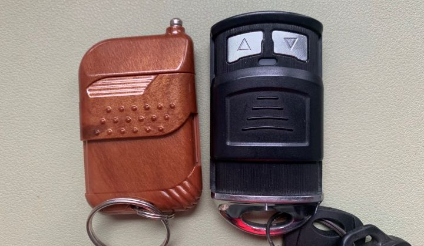
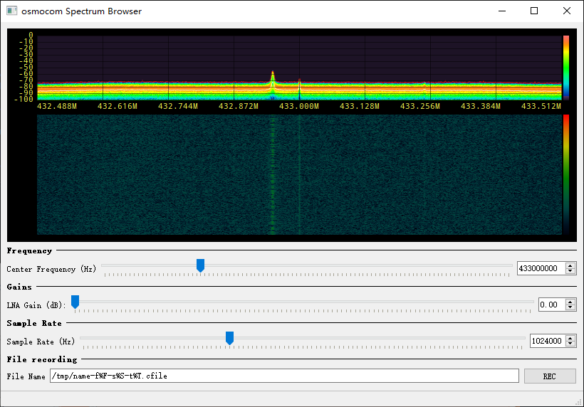
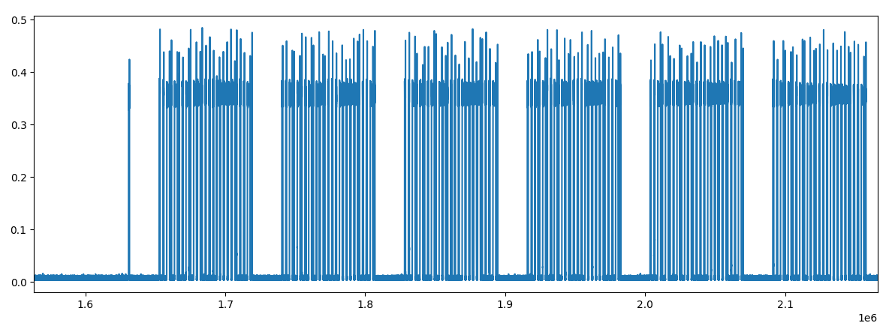

之前，家里的院门换了一个可以遥控开关的推拉门。我妈念叨着要是忘了钥匙，也没带遥控器怎么办，要是这扇门能一喊就开就好了。我想着要是能知道遥控器和门之间的通讯协议，那我是不是也可以自己发送相应的数据，用来自动控制。正好家里有一个之前买的RTL-SDR，可以用来监听电磁信号，姑且拿它来试一试。

## 遥控器

看了看家中车库门和大门的遥控器，上面各有4个键，一个是开门键，一个是关门键，还有另外两个并不知道是什么功能。这两个遥控器看上去是一样的功能，大门开关起来并不方便，就拿车库门来试试吧。

查了查网络上的资料，有人做过类似的[调查](https://medium.com/@eoindcoolest/decoding-a-garage-door-opener-with-an-rtl-sdr-5a47292e2bda#.qu46ncrr3)。一般来说这样的遥控器工作在433MHz左右的频率，内部使用直列的拨片开关（DIP Switch）控制每一个按键所发射的信号值。这些信号值会经过编码的过程之后调制在433MHz的电磁载波上发射出去。从维基百科的[LPD433](https://en.wikipedia.org/wiki/LPD433)的页面上来看，在这个频段上发射接收信号在大部分国家是不需要申请许可的，主要用于发射功率不超过10mW的低功耗设备进行通讯。这类遥控器会使用最简单的[开关键控（OOK）](https://zh.wikipedia.org/wiki/OOK)的方式将发送数据的莫尔斯码调制到载波上。

## 软件无线电（Software Defined Radio）

之前买过一个RTL-SDR，是一个低成本的软件无线电，价格在60到100元不等。可以用USB接到电脑上用软件（如Gnu Radio）监听空气中的无线电信号。RTL-SDR工作的频率范围在25MHz到1.76GHz，所以针对433MHz附近的载波频率应该是没有问题的。

通讯中的信号都可以用如下的式子进行表示：$f(t)=A(t)\sin(2\pi f_ct+\phi(t))$。其中$A(t)$是我们调制在载波幅度上的信号，而$\phi(t)$则是调制在载波相位上的信号，$f_c$是载波频率。我们将这样的式子进行分解可以得到：$f(t)=A(t)\cos(\phi(t))\sin(2\pi f_ct) + A(t)\sin(\phi(t))\cos(2\pi f_ct)$，令$i(t) = A(t)\cos(\phi(t))$和$q(t)=A(t)\sin(\phi(t))$，就有$f(t)=i(t)\sin(2\pi f_ct) + q(t)\cos(2\pi f_ct)$。SDR里面采集的信号被称为I/Q信号，就是上式所示的$i(t)$和$q(t)$。通过I/Q信号就可以还原出原始用于调制的基带信号$A(t)=\sqrt{i^2(t) + q^2(t)}$和$\phi(t)=\arctan{\frac{q(t)}{i(t)}}$。

## 中心频率

首先要确定遥控器所使用的中心频率。安装好Gnu Radio之后，在终端里面输入`osmocom_fft -F -f 433e6 -s 4e6`，打开频谱监视图，按下遥控器对应按钮的按键，观察频谱图的变化。

从频谱图上可以看到，按下按钮之后在432.95MHz的频点上有较大的峰值，我们猜想这个遥控器所使用的载波频率就是432.95MHz。

## 录制与分析信号

确定了中心频率之后，打开Gnu Radio，绘制录制框图如下：

左边的框图的作用是以432.95MHz的载波频率解调接收到的电磁波，即上文中提到的I/Q信号，将其发送到右边的显示接口（GUI Sink）将其保存下来（File Sink）。

打开录制好的信号文件，用Python将其基带信号的幅值，即$A(t)$显示如下图：

当按下按键之后，遥控器会一直向外重复发送同样的信号，每次发送之间都有一些较长的间隔。我们可以认为这个间隔之间即是我们想要的信号。将录制好的信号放大拉宽，用红色的线标识出其发生变化的时间如下图。从图上可以比较明显的看出这是一个数字信号，与我们之前查找资料时遥控器采用的OOK方式的猜想相符。

将上面的信号转换成二进制则为
1 000 1 000 11101 000 11101 000 1 000 11101 000 111011101 000 1 000 1 000 1 000 111011101110111011101 000 1 000 1 000 11101。

[莫尔斯码表](https://en.wikipedia.org/wiki/Morse_code)中使用dit（点，1）和dah（划，111）来表示两种信号。每一个英文字母由若干个点和划组成，点和划间有一个短间隔（用0）表示。英文字母间有一个长间隔（用000）表示。比如SOS，用莫尔斯码表示为（10101 000 11101110111 000 10101）。所以我们从遥控器中得到的二进制数可以转换成：EENNENGEEE0EEN

## 总结

本来想用录下来的信号进行重放，看看是不是真的能够打开大门。不过试了几次都门都没有任何反应。后来查了下文档才发现，RTL-SDR使用的Realtek 2832的芯片是一个DVB的解码器，并不带有发射的功能。重放的功能暂此作罢。之后再去搞一个HackRF或者RFcat来试试。

不过不论怎么说，车库门或者大门使用这么简单的无线方案谈不上安全。虽然用于遥控的数据长度是足够的，10几位的英文字母加数字对于暴力破解还是有比较高的门槛的。不过，这样的方案不能防止重放攻击。只要我录下了别人的某一次开门关门时的信号，或者知道上述破解出来的英文字符，就相当于掌握了这扇门的开关钥匙。所以还是小心为妙啊。

## Reference

1. [Decoding a garage door opener with an RTL-SDR | by Eoin | Medium](https://medium.com/@eoindcoolest/decoding-a-garage-door-opener-with-an-rtl-sdr-5a47292e2bda#.qu46ncrr3)

2. [In-phase and quadrature components - Wikipedia](https://en.wikipedia.org/wiki/In-phase_and_quadrature_components)

3. [LPD433 - Wikipedia](https://en.wikipedia.org/wiki/LPD433)

4. [On–off keying - Wikipedia](https://en.wikipedia.org/wiki/On–off_keying)

5. [Morse code - Wikipedia](https://en.wikipedia.org/wiki/Morse_code)

