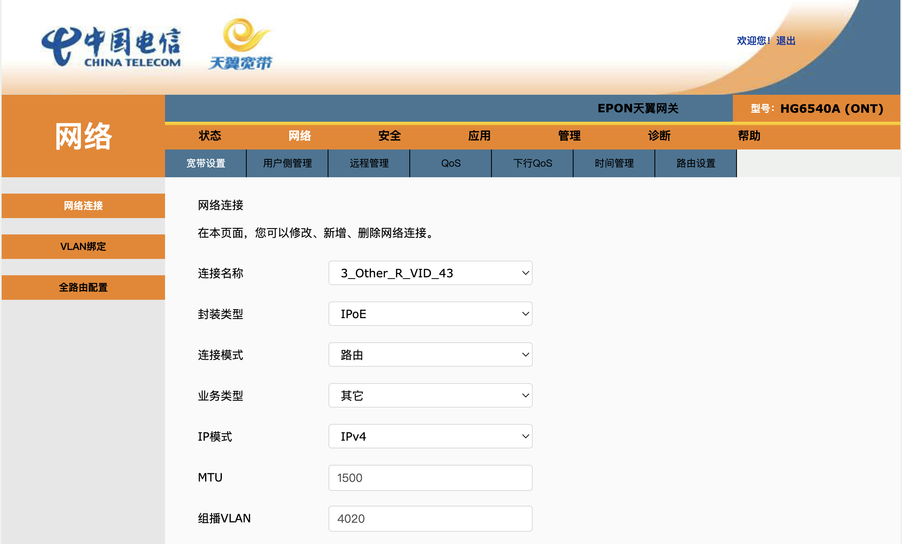
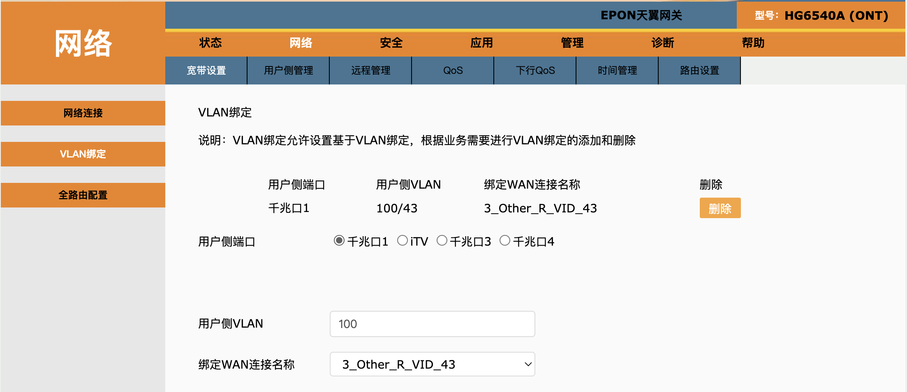
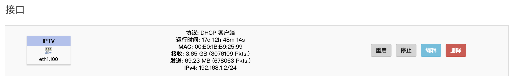
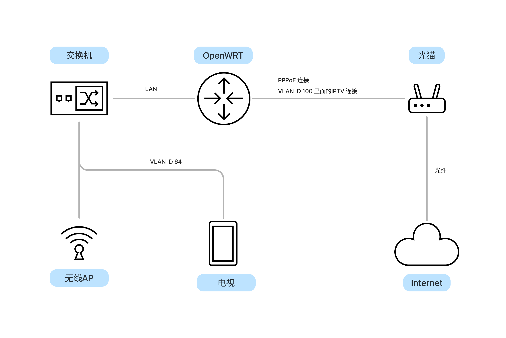
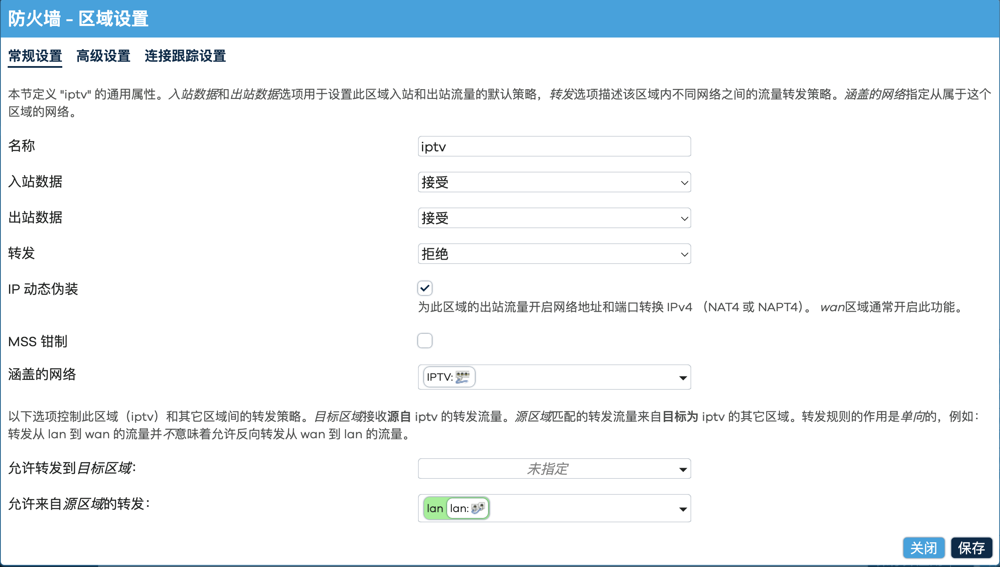
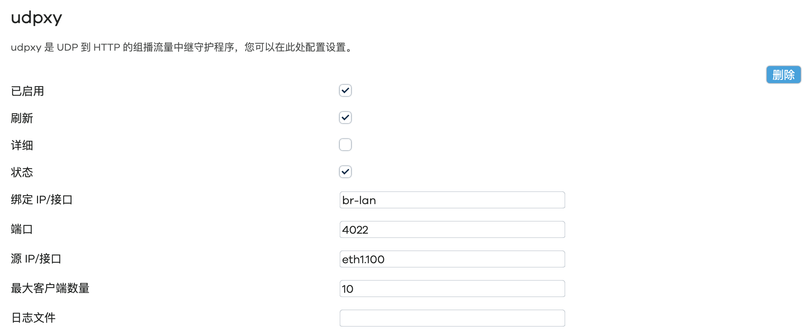
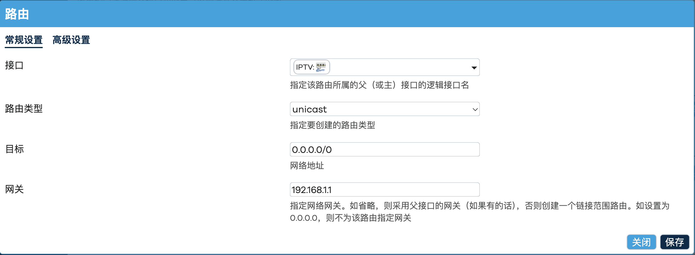
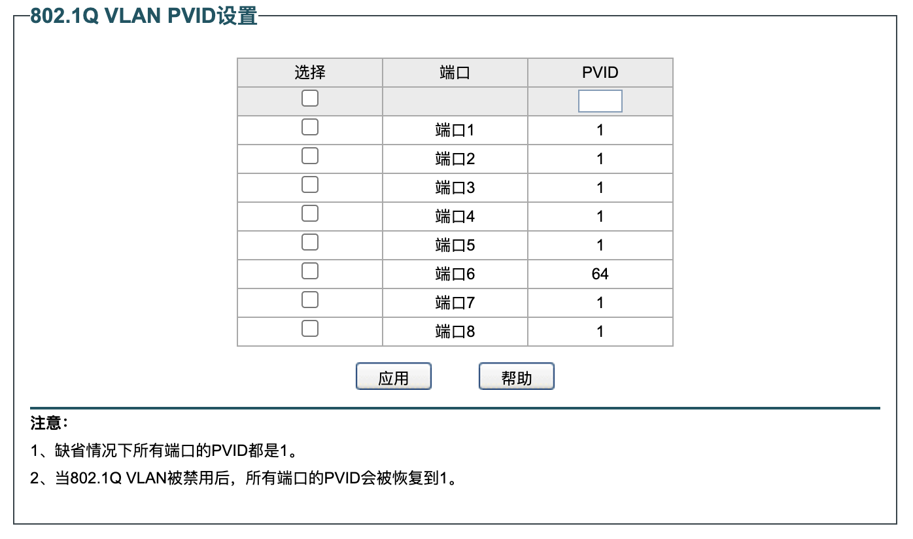
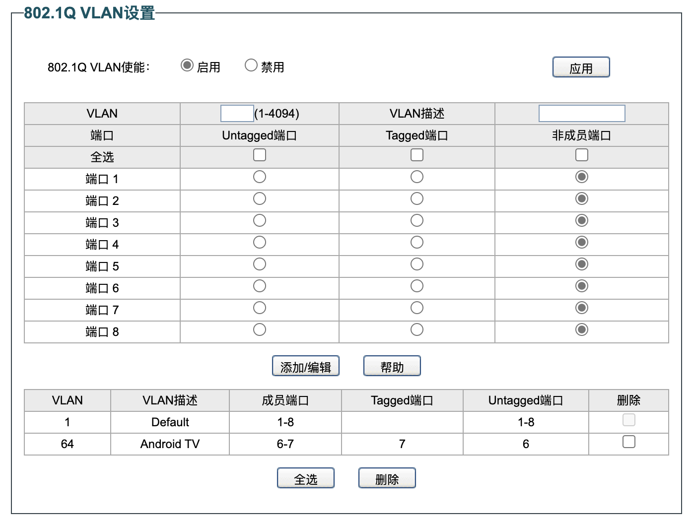
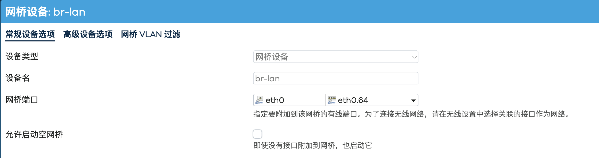

搬了家之后装了一条新的宽带，也花钱办了一条iptv，原本以为会像以前一样给一个电视的小盒子。但是电信的师傅上门来的时候却说现在没有这种电视盒子了，都是安装在电视上的一个app可以直接看。当时由于家里装修还没有完全弄好，就搁置在了一边。后来弄好后问了宽带师傅，想要看电视，需要先把光猫里面的全路由方式打开，这样就和我想直接通过软路由拨号的理由背道而驰。所有就暂时搁置了这个想法。最近正好得闲，想来研究一下这个问题。

## 概述
一般来说，运营商提供IPTV都是通过专网的方式进行提供的。运营商通过一根光纤接入到住户的家里，通常这根光纤里面会有3条独立的LAN连接：一条是TR069，是运营商用于远程管理光猫配置的一个连接。另外一条是Internet连接，我们一般用于连接互联网的数据就是通过这个连接发送和接收的。最后一条是IPTV连接，用于发送和接收电视数据。光猫上有若干个接口，在出厂的时候IPTV的连接是被绑死在一个端口上的，只有电视或者机顶盒连接到这个端口上才可以正常的收看电视。

为了要共享IPTV，可以将这个IPTV的接口单独连接到路由器上，在路由器上做流量的再分发。不过我现在的路由器上只有一个接口可以连接光猫，连接了IPTV就无法再连接宽带了。所以需要将IPTV的这个连接通过VLAN的方式也绑定到宽带的接口上去。这就需要修改光猫里面的配置了，这个配置要通过管理员的权限进入到配置页面才可以修改。

## 光猫的管理员密码
通常光猫的背后都会有一张贴纸，贴纸上写着光猫的地址和密码。不过这个密码是用户密码，登陆进去几乎没有什么可配置的东西。比如说，如果想要不通过光猫进行拨号和路由，我们就需要将互联网的连接进行桥接，这个配置是需要通过管理员界面进行的。

虽然，当初安装宽带的时候，安装小哥就给了我光猫的管理员密码，不过最近一试发现密码已经不对了。估计是之间某次重启的时候，光猫的管理员密码会被远程重置。看了下型号，现在的光猫是烽火科技的，网上一搜就有如何获取管理员密码的内容，这也应该是开发者留下的后门。

首先要通过一个HTTP请求打开光猫的telnet，可以使用如下的python脚本进行：
```python
def enable_telnet(enable: bool):
    enable_string = "1" if enable else "0"
    r = requests.get(f"http://{HOST}:8080/cgi-bin/telnetenable.cgi?telnetenable={enable_string}&key={mac}")
    print(r.status_code())
```
key是对应的光猫的MAC地址

接着就可以通过telnet登陆上光猫了，用户名为`telnetadmin`，密码为`FH-nE7jA%5m`再加上mac的后六位。登入telnet之后就可切换为超级用户，密码为`Fh@`加上MAC的后六位。继而通过下面这个命令就可以获得光猫的管理员密码了：
```bash
$ cfg_cmd get InternetGatewayDevice.DeviceInfo.X_CT-COM_TeleComAccount.Password
```

## 配置光猫
我们用管理员密码登入光猫就会得到类似下图的一个界面，显示了IPTV的连接情况，这条连接使用DHCP的方式，通过Option60的方式鉴权，拿到了专网的IP地址，并且会将一些特定的IP地址转发到这个专网内。



点击VLAN绑定，我们可以将这个连接和宽带的接口绑定在一起：



当然通过telnet我们也可以看到更为详细的连接配置，包括网络流量的过滤等功能。在此不赘述了。

## 连接的拓扑结构

配置好了光猫，我们在Openwrt上也要新建一个连接用来发送IPTV的数据。这个连接使用了VLAN以对印上光猫上的配置。这个连接使用了DHCP来获得一个光猫LAN侧的IP地址，光猫的LAN侧使用了一个192.168.1.1/24的子网。注意到这个IP地址和光猫端用于连接IPTV的IP地址并不相同，可见对于IPTV的流量而言，光猫还是起了一个路由的作用。



这样我们就得到了一个如下图所示的网络拓扑结构：


路由器通过一根网线连接光猫，这根网线上承载着两条LAN，一条LAN用于PPPoE连接互联网，没有VLAN ID。另外一条LAN用于连接IPTV专网，VLAN ID为100。

在IPTV专网中，IPTV的直播视频流数据是通过组播分发的。**组播（Multicast）** 是相对**单播（Unicast）** 而言的。通常一个IP包会有一个目的地，对于单播而言，这个目的地是一台设备，而对于组播而言，这个目的地是一系列的设备。对于直播视频流而言，一对一地从源服务器进行数据分发是一个非常没有效率的行为。这会导致网络中重复发送了许多相同的数据，仅有的不同是这个数据的目的IP不一样。在路由的网络中，一个数据包会经过若干个路由节点，最后才到达最终的目的地，如果我们能在路由节点上对数据进行复制和转发，那么就可以节省下非常大的数据开销。这就是组播诞生的原因。

组播是通过IGMP协议进行管理的。IGMP协议中，每一个组播流会对应一个组播IP地址。组播IP地址是特定的IP地址段，即224.0.0.0/4（224.0.0.0 - 239.255.255.255）。一般来说一个视频流会占据一个组播IP地址。当客户端想要收看某一个频道时，这个客户端会发出一个IGMP协议加入这个组播IP地址。这个时候这个客户端的网络栈会记住这个组播IP地址，并且把发往这个组播IP地址的数据转发到本机。这个IGMP协议会发往本地网络内的路由器，路由器也会维护一个组播路由表，即会记住这个组播的请求从哪个接口来，并在上游发送该组播地址数据的时候将其转发到对应的接口上。路由器也会将IGMP加入协议发往其上游的路由器中。这样我们就构建了一个组播数据的分发网络。

当我们在Openwrt上新建了这个IPTV的接口之后，在对应的防火墙上也要配置允许其入站和出站流量，并且允许来自LAN区域的转发。因为这个接口也连接着光猫本身，可以通过这个接口访问光猫本身的管理界面。不过当新建这个接口的时候要注意去除默认路由的勾选，不然所有本应去往WAN口的流量都有可能被这个接口接管。



## 配置Udpxy实现IPTV直播共享

当我们成功配置了IPTV了之后，如果在我们的本地网络有一个可以播放组播地址的客户端，比如VLC。在我们输入了正确的组播地址之后就可以收看到IPTV的电视节目了。

不过，如果我们的本地网络中有了无线的AP或者路由器，情况就有一些不同了。前面我们说到，当路由器收到上游发送过来的组播数据时，会按照其组播路由表中的映射将其转发到对应的接口上。但如果这个接口上接了一个无线网络，无线的AP会将组播数据当成一个广播数据进行发送，并通常使用最低速率进行发送。并且广播数据不要求客户端进行应答（ACK），这就拉低了整个网络的性能和可靠性。

一般来说，在无线网络上会推荐使用多播转单播的方式进行配置。udpxy就是在openwrt上将多播转单播的这么一个插件。下图是udpxy的配置界面：



配置其服务的接口为我们的LAN网络，上游接口为eth1.100，就是上文中我们设置的IPTV接口。udpxy会监听4022端口上的HTTP请求，并转换成对应的IGMP加入协议向上游发送。

这个时候我们就可以使用任何的流媒体客户端观看IPTV的节目了。比如在江苏电信的网络里我们可以使用`http://[路由器IP地址]:4022/udp/239.49.8.19:9614`来观看CCTV1的节目了。

## 配置Android TV上的IPTV客户端

当上述配置都完成了之后，我打开电信师傅给的app，发现并不能正常工作。一时没有头绪，不如把app解包看一看里面在做什么。

App里面有诸多的功能，在app启动的时候会检测iptv专网和公网的访问情况。其中iptv专网使用了一些特别的IP地址，这些地址看上去像是一个公网地址，但经测试这些地址在公网上并不可达。那么为了让app可以访问到这些ip地址，那么在路由这一层就需要将这些ip地址定向的路由到iptv的专网中（在我们的配置中为eth1.100，而不是wan口）。联想到在光猫的配置中也有类似的基于IP地址的路由，可以将光猫中的那些IP地址作为参照，在我们的局域网中做类似的路由。

Openwrt升级到23.04之后，原本使用的iptables已经不再可用，我们需要用最新的nftables来实现这个功能。nftables是Linux系统中一个常用的配置网络环境和防火墙的工具。nftables的使用说明有些冗杂，在此不再详细展开。简而言之，我们将所有需要路由至专网的IP地址的集合加入到一个nftable的IP set中。在nftables中定义了几个网络栈处理的钩子，我们使用PREROUTING的钩子，定义一个策略：如果进入的数据包的目的ip地址在之前定义的IP set中，我们给这个数据包打上一个标记。对这个标记的数据包设定一个专门的路由规则：查询iptv的路由表。在这个iptv的路由表中只有一条记录，默认路由通过eth1.100接口，并使用NAT。

首先要在`/etc/iproute2/rt_tables`这个文件里面定义一个新的路由表iptv。然后在OpenWrt的路由配置页面增加一个新的IPv4规则（网络->路由->IPv4规则），其中表选择iptv，在高级选项中的防火墙标志写入标记（比如：0x24000000/0xfc000000）。保存后可以使用命令行进行验证：
```
root@OpenWrt:~# ip rule
0:	from all lookup local
32759:	from all fwmark 0x65 lookup 100
32760:	from all fwmark 0x24000000/0xfc000000 lookup iptv
32766:	from all lookup main
32767:	from all lookup default
```
第三行即为我们添加的路由。

接着我们为iptv的路由表中添加一个路由规则，同样在网络->路由->静态IPv4路由中添加一个规则，接口为iptv，网关为192.168.1.1，在高级设置中规定路由表为iptv。



同样可以使用命令行验证：
```
root@OpenWrt:~# ip route show table iptv
default via 192.168.1.1 dev eth1.100 proto static
```
可以看到在iptv这个路由表中增加了一条默认的静态路由。

为了持久化这个路由的规则，需要在`/etc/nftables.d/`中添加如下的内容
```
set iptv_forward_list {
    type ipv4_addr
    flags interval
    auto-merge
    elements = { 58.223.36.0/24, 58.223.79.97-58.223.79.111,
        58.223.88.0/24, 58.223.144.0/24,
        58.223.251.65-58.223.251.94, 58.223.251.136/29,
        ...
    }
}

chain user_pre_prerouting {
    type filter hook prerouting priority -200; policy accept;
    meta mark 0x0/6 jump iptv_mangle
}

chain iptv_mangle {
    ip daddr @iptv_forward_list meta mark set meta mark & 0x27ffffff | 0x2400000
}
```

配置完这些，打开app，就可以进入正常的界面了。

## 设置组播的VLAN划分

App的直播使用了IGMP的组播流，正如前面提到的，直接的组播流接入无线网络会造成性能上的一些问题。所有电视是通过有线网络接入到路由器上的。看上去万事大吉，不过在观看了一段时间过后，依然出现了一些不稳定的现象，例如组播断流。我特意检查了交换机，发现交换机不支持IGMP侦听（Snooping）。IGMP侦听是交换机对于组播数据的优化，当交换机检测到某个端口加入了某个组播组，交换机会记住这个映射，当有组播的数据往下发的时候，交换机会自动转发到对应的端口上，而不必广播所有的数据。特别当我的交换机上还连接着无线AP，交换机的IGMP侦听就显得尤为重要了。

然而，查阅了交换机的手册和搜寻了网上的一些信息，我所购置的交换机并不能支持IGMP的侦听功能，但可以进行VLAN的划分。所以我需要对连接电视机的端口进行VLAN的隔离。

交换机上一共有8个端口，其中电视机连接到了6号端口上，路由器连接到了7号端口上。我们想在6号和7号端口之间设立一条额外的VLAN，这条VLAN和其他进入交换机的数据进行隔离。

首先，我们开启交换机的VLAN功能，设置6号和7号端口的VLAN ID为64。设置端口6的pvid为64，而其他所有端口的pvid为1。这意味着所有进入端口6的没有VLAN ID的数据包将会被打上64的标签，而所有进入其他端口的数据包会被打上1的标签。



接下来设置VLAN端口的绑定：默认的规则是对于VLAN ID为1的所有数据包，送出1号到8号端口的时候，这个VLAN ID都会被删除。另外一条对于VLAN ID为64的规则是，当这个数据包要从端口6倍送出时，VLAN ID会被删除，但如果要从端口7（即路由器）输出时，这个ID会被保留。


这样我们就在6号端口和7号端口之间构建了一条VLAN。于此同时，我们也要在路由器端，将这个新的VLAN加入到LAN口的网桥上，并开启IGMP侦听功能。那么从端口6过来的IGMP加入报文就会被路由器记住，从上游过来的组播数据就仅会发给端口6，而不会出现在其他的端口上。

